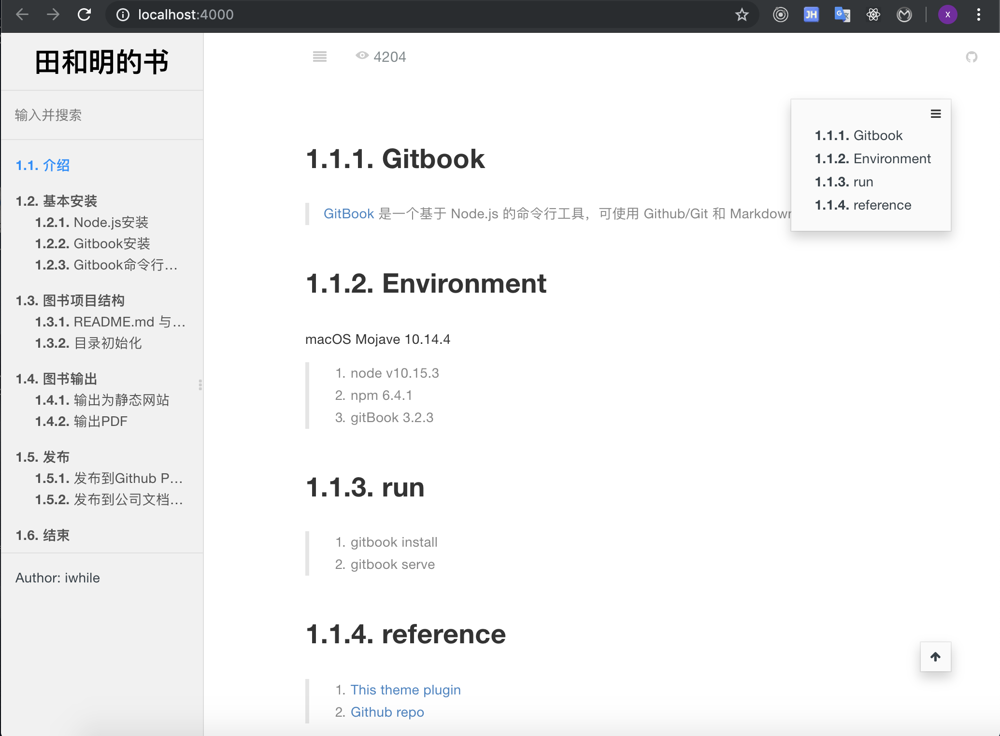

# blogbook
> 1. blogbook 是基于[GitBook](https://www.gitbook.com/) 构建的。GitBook是一个基于 Node.js 的命令行工具，可使用 Github/Git 和 Markdown 来制作精美的电子书。
> 2. blogbook 使用markdown和git来记录存储 Programming knowledge.

An example snapshot:

# environment
macOS Mojave 10.14.4 or Deepin15.10.1
> 1. node v10.15.3
> 2. npm 6.4.1
> 3. gitBook 3.2.3

# run
> 1. gitbook install 
> 2. gitbook serve

# reference
> 1. [This theme plugin](https://www.npmjs.com/package/gitbook-plugin-theme-code)
> 2. [Github repo](https://github.com/Yakima-Teng/gitbook-plugin-theme-code)
